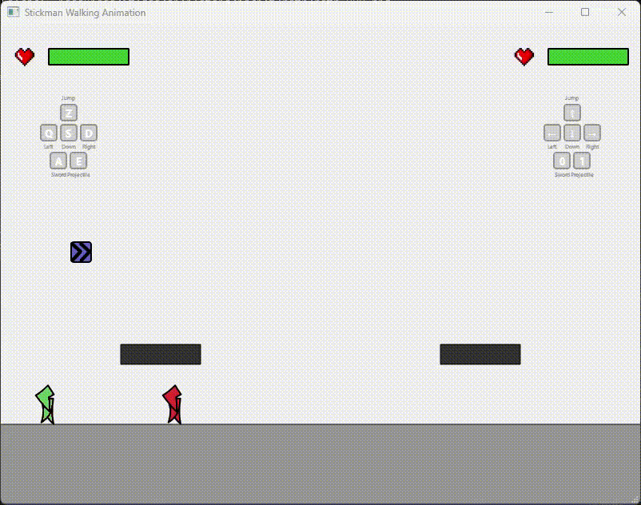
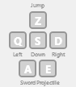
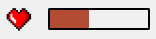
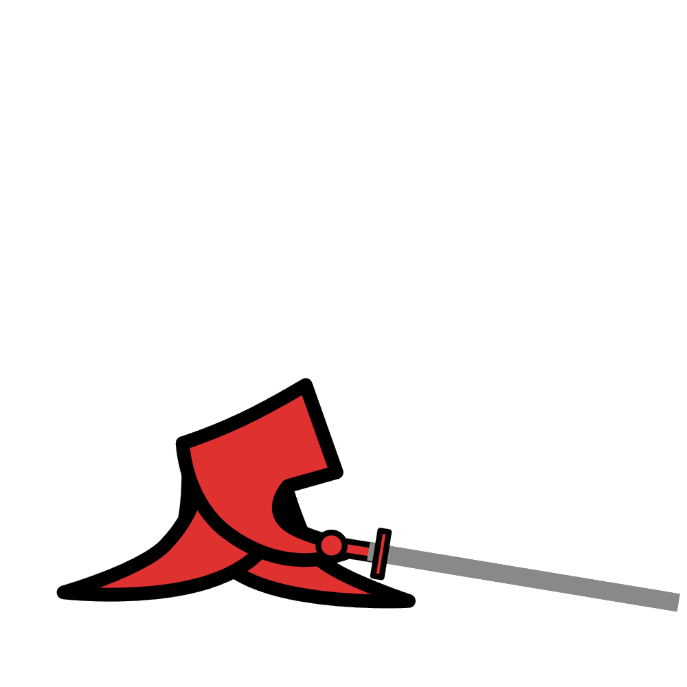
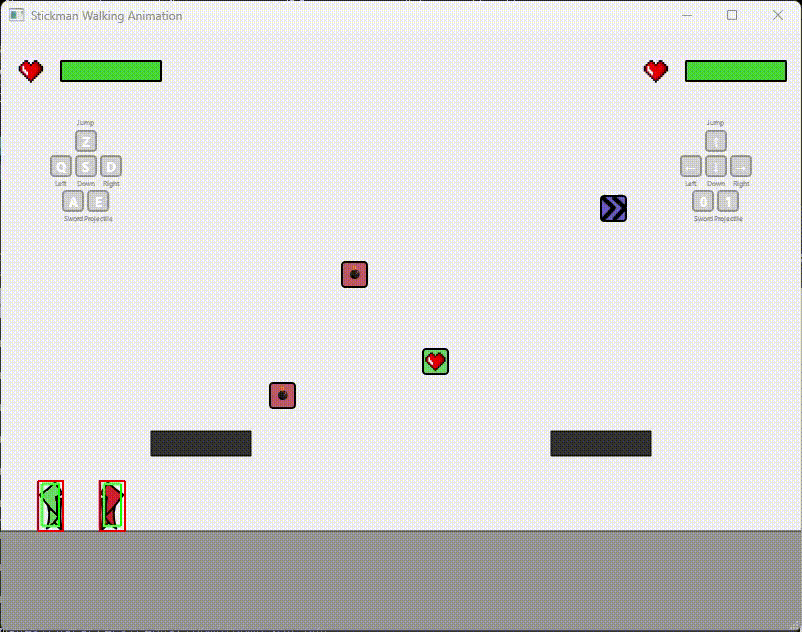

# Stickman Fighting Game

A 2D fighting game developed as a school project using C++ and Qt framework. Battle against your opponent with various attacks, special moves, and power-ups!

## Gameplay Overview



*Two players battle it out in this fast-paced fighting game!*

## Controls



### Player 1 (Left Side)
- **Z**: Jump / Double Jump
- **Q**: Move Left
- **S**: Move Down / Crouch
- **D**: Move Right
- **A**: Sword Attack
- **E**: Projectile Attack

### Player 2 (Right Side)
- **↑**: Jump / Double Jump
- **←**: Move Left
- **↓**: Move Down / Crouch
- **→**: Move Right
- **0**: Sword Attack
- **1**: Projectile Attack

## Bonuses

Collect power-ups that spawn randomly on the battlefield to gain advantages!

### Bomb Bonus 


Spawns multiple bombs that explode after a short delay, dealing damage to your opponent.

### Speed Boost 


Temporarily increases your movement speed for a limited time.

### Health Pack 


Restores health points instantly.

## Health Bar



The health bar dynamically changes color based on remaining health:
- **Green**: High health (near 100%)
- **Yellow**: Medium health (around 50%)
- **Red**: Low health (near 0%)

## Character Actions

### Jump


Press the jump key to leap into the air. Can perform a double jump while airborne for enhanced mobility.

### Slide


Press down while running to perform a sliding move that allows you to evade attacks and move quickly under opponents.

### Sword Attack


Execute a powerful sword strike to damage your opponent. Each character has unique sword attack animations.

### Low Sword Attack (Combo)


**Special Combo**: Press **Down** and **Sword Attack** keys simultaneously while crouching to perform a low sword attack. This ground-level attack can catch opponents off-guard!

## Debugging - Hitbox Visualization



For debugging purposes, you can enable hitbox visualization by setting `draw_boxes` to `true` in the Character class. This will display:
- **Red boxes**: Asset/sprite boundaries
- **Green boxes**: Character collision hitboxes
- **Blue boxes**: Sword attack ranges

## Technical Details

### Physics Engine
The game uses **Position-Based Dynamics** for realistic physics simulation, providing smooth and responsive character movements, collision detection, and projectile trajectories.

### Technologies Used
- **C++17**: Core game logic
- **Qt 6.10**: GUI framework and rendering
- **CMake**: Build system
- **Ninja**: Build tool

## Building the Project

1. Ensure you have Qt 6.10+ installed
2. Configure CMake:
   ```bash
   cmake -S . -B build -G Ninja -DCMAKE_PREFIX_PATH=<path_to_qt>
   ```
3. Build:
   ```bash
   cmake --build build
   ```
4. Run the executable from the build directory

---

**Note**: This project was developed as part of a school assignment to demonstrate C++ programming skills, game development concepts, and GUI application development using Qt framework.
